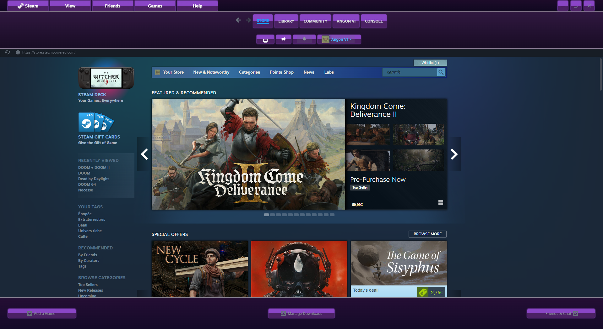

# Heliotrope - AeroGlass Theme for Steam

Heliotrope is a modern and elegant AeroGlass-inspired theme for Steam, bringing a semi-transparent, glossy visual style reminiscent of Windows Vista's Aero design. This theme enhances Steam's interface with smooth gradients, subtle shadows, and a refined purple aesthetic.

## 📷 Preview


## ✨ Features
- **AeroGlass-inspired design** with semi-transparent elements
- **Soft gradients and smooth shadows** for a modern touch
- **Customized buttons and headers** for consistency
- **Refined purple aesthetic** matching the Heliotrope flower

## 📥 Installation
1. **Download the theme**
   ```sh
   git clone https://github.com/angon-6/Heliotrope.git
   ```
2. **Move the theme folder** to Steam's `skins` directory:
   - Windows: `C:\Program Files (x86)\Steam\steamui\skins\`
3. **Enable the theme in Steam:**
   - Go to **Steam Settings > Themes**
   - Select **Heliotrope** from the dropdown menu
   - Restart Steam

## 📝 Issues & Suggestions
If you encounter issues or have suggestions, feel free to open an **issue**.

---
🌸 **Heliotrope - Enhance your Steam experience with AeroGlass beauty!**
